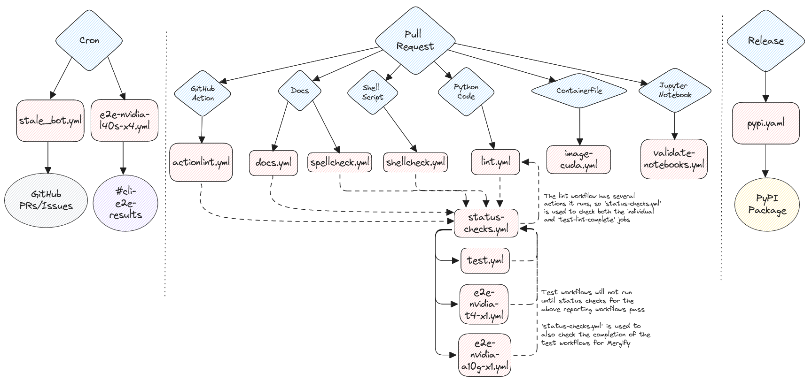
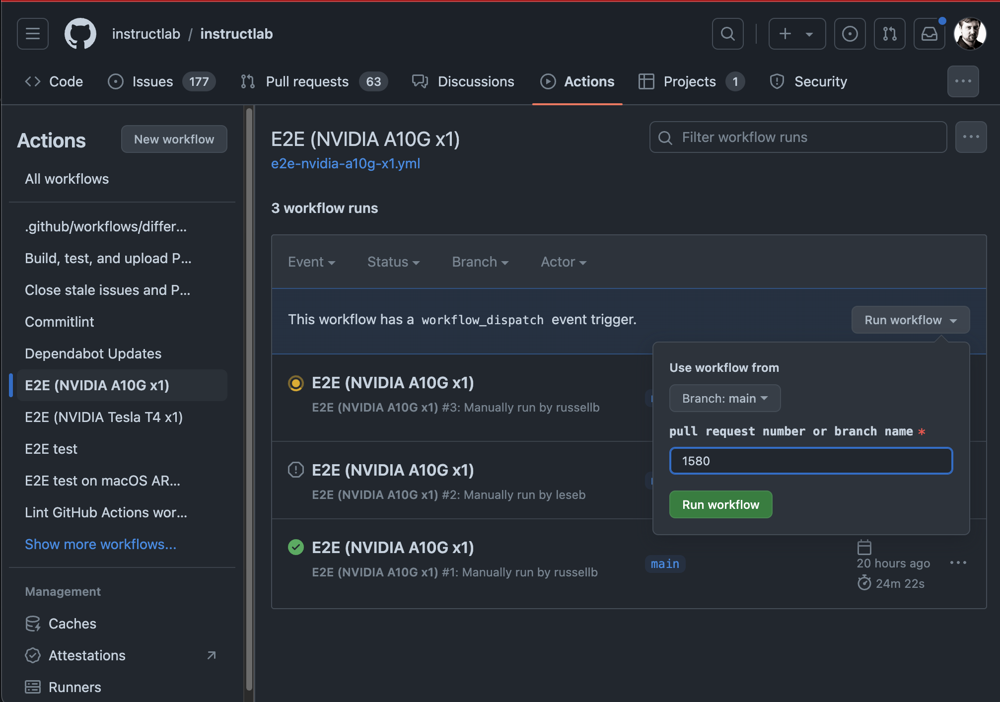

# CI for InstructLab

## Unit tests

Unit tests are designed to test specific InstructLab components or features in isolation. In CI, these tests are run on Python 3.11 and Python 3.10 on CPU-only Ubuntu
runners as well as Python 3.11 on CPU-only MacOS runners. Generally, new code should be adding or modifying unit tests.

All unit tests currently live in the `tests/` directory and are run with [pytest](https://docs.pytest.org/) via [tox](https://tox.wiki/).

## Functional tests

Functional tests are designed to test InstructLab components or features in tandem, but not necessarily as part of a complex workflow. In CI, these tests are run on
Python 3.11 and Python 3.10 on CPU-only Ubuntu runners as well as Python 3.11 on CPU-only MacOS runners. New code may or may not need a functional test but should strive
to implement one if possible.

The functional test script is Shell-based and can be found at `scripts/functional-tests.sh`.

## End-to-end (E2E) tests

There are two test scripts. The first can be found at `scripts/basic-workflow-tests.sh`.
This script takes arguments that control which features are used to allow
varying test coverage based on the resources available on a given test runner.

The second can be found at `scripts/e2e-ci.sh`. This script is designed to test the
InstructLab workflow from end-to-end, mimicking real user behavior.

There is currently a ["small" t-shirt size E2E job](https://github.com/instructlab/instructlab/blob/main/.github/workflows/e2e-nvidia-t4-x1.yml).
This job runs automatically on all PRs and after commits merge to `main` or release
branches. It depends upon the successful completion of any linting type jobs.

There is also a ["medium" t-shirt size E2E job](https://github.com/instructlab/instructlab/blob/main/.github/workflows/e2e-nvidia-a10g-x1.yml) and ["large" t-shirt size E2E job](https://github.com/instructlab/instructlab/blob/main/.github/workflows/e2e-nvidia-l40s-x4.yml) that can be triggered manually on the [actions
page](https://github.com/instructlab/instructlab/actions) for the repository.
These run on a variety of instance types and can be run at the discretion of
repo maintainers.

The "large" t-shirt size E2E job also runs automatically against the `main` branch at 11AM UTC every day.

### E2E Test Coverage Options

You can specify the following flags to test various features of `ilab` with the
`basic-workflow-tests.sh` script - you can see examples of these being used within
the E2E job configuration files found
[here](https://github.com/instructlab/instructlab/blob/main/.github/workflows/).

| Flag | Feature |
| --- | --- |
| `e` | Run model evaluation |
| `F` | Run "fullsize" SDG |
| `q` | Run the 'simple' training pipeline with 4 bit quantization |
| `s` | Run the 'simple' training pipeline |
| `f` | Use the 'full' training pipeline optimized for CPU and MPS rather than simple training |
| `a` | Use the 'accelerated' training library rather than simple or full training |
| `m` | Run minimal configuration (lower number of instructions and training epochs) |
| `M` | Use Mixtral model (4-bit quantized) instead of Merlinite (4-bit quantized) |
| `P` | Use the phased training within the 'full' training library |
| `v` | Run with vLLM for serving |

You can specify the following flags to test the medium and large t-shirt sizes with the `e2e-ci.sh`
script. Support for the recommended workflow for the small t-shirt size will be added to this script in the future.

| Flag | Feature |
| --- | --- |
| `m` | Run the e2e workflow for the medium t-shirt size of hardware |
| `l` | Run the e2e workflow for the large t-shirt size of hardware |
| `p` | Preserve the E2E_TEST_DIR for debugging |

### Current E2E Jobs

| Name | T-Shirt Size | Runner Host | Instance Type | OS | GPU Type | Script | Flags | Runs when? | Slack reporting? |
| --- | --- | --- | --- | --- | --- | --- | --- | --- | --- |
| [`e2e-nvidia-t4-x1.yml`](https://github.com/instructlab/instructlab/blob/main/.github/workflows/e2e-nvidia-t4-x1.yml) | Small | AWS | [`g4dn.2xlarge`](https://aws.amazon.com/ec2/instance-types/g4/) | CentOS Stream 9 | 1 x NVIDIA Tesla T4 w/ 16 GB VRAM | `basic-workflow-tests.sh` | `msq` | Pull Requests, Push to `main` or `release-*` branch | No |
| [`e2e-nvidia-a10g-x1.yml`](https://github.com/instructlab/instructlab/blob/main/.github/workflows/e2e-nvidia-a10g-x1.yml) | Medium | AWS |[`g5.4xlarge`](https://aws.amazon.com/ec2/instance-types/g5/) | CentOS Stream 9 | 1 x NVIDIA A10G w/ 24 GB VRAM | `e2e-ci.sh` | `m` | Pull Requests, Push to `main` or `release-*` branch | No |
| [`e2e-nvidia-l40s-x4.yml`](https://github.com/instructlab/instructlab/blob/main/.github/workflows/e2e-nvidia-l40s-x4.yml) | Large | AWS |[`g6e.12xlarge`](https://aws.amazon.com/ec2/instance-types/g6e/) | CentOS Stream 9 | 4 x NVIDIA L40S w/ 48 GB VRAM (192 GB) | `e2e-ci.sh` | `l` | Manually by Maintainers, Automatically against `main` branch at 11AM UTC | Yes |

### E2E Test Coverage Matrix

| Area | Feature | [`e2e-nvidia-t4-x1.yml`](https://github.com/instructlab/instructlab/blob/main/.github/workflows/e2e-nvidia-t4-x1.yml) | [`e2e-nvidia-a10g-x1.yml`](https://github.com/instructlab/instructlab/blob/main/.github/workflows/e2e-nvidia-a10g-x1.yml) | [`e2e-nvidia-l40s-x4.yml`](https://github.com/instructlab/instructlab/blob/main/.github/workflows/e2e-nvidia-l40s-x4.yml) |
| --- | --- | --- | --- | --- |
| **Serving**  | llama-cpp                 |✅|✅|⎯|
|              | vllm                      |⎯|✅|✅|
| **Generate** | simple                    |✅|✅|⎯|
|              | full                      |⎯|⎯|✅|
| **Training** | simple                    |✅(*1)|⎯|⎯|
|              | full                      |⎯ |✅|⎯|
|              | accelerated (multi-phase) |⎯|⎯|✅|
| **Eval**     | eval                      |⎯|✅(*2)|✅|

Points of clarification (*):

1. The `simple` training pipeline uses 4-bit-quantization.
2. `MMLU Branch` is not run due to the `simple` SDG pipeline not outputting all the needed files in the tasks directory.

### Slack reporting

Some E2E jobs send their results to the InstructLab Slack workspace channel `#cli-e2e-results` via the `Son of Jeeves` bot. This has been implemented
via [the official Slack GitHub Action](https://github.com/slackapi/slack-github-action?tab=readme-ov-file#technique-2-slack-app). You can see which jobs currently have reporting via the "Current E2E Jobs" table above.

### Triggering an E2E job via GitHub Web UI

For the E2E jobs that can be launched manually, they take an input field that
specifies the PR number or git branch to run them against. If you run them
against a PR, they will automatically post a comment to the PR when the tests
begin and end so it's easier for those involved in the PR to follow the results.

1. Visit the [Actions tab](https://github.com/instructlab/instructlab/actions).
2. Click on one of the E2E workflows on the left side of the page.
3. Click on the `Run workflow` button on the right side of the page.
4. Enter a branch name or a PR number in the input field.
5. Click the green `Run workflow` button.

Here is an example of using the GitHub Web UI to launch an E2E workflow:

